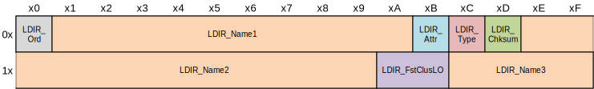

# Файловая система

## Введение

В состав компьютера входят два типа памяти: оперативная и постоянная.
Оперативная память связана напрямую с процессором и хранит исполняемую программу и обрабатываемые данные.
Процессор обращается к памяти за инструкцией и данными к нему, исполняет ее и помещает результат обратно в память.
После выполнения программы в памяти формируется результат.
В оперативную память загружаются следующие программа и данные к нему и процесс повторяется снова.
Результат предыдущей программы должен быть где-то сохранен.
Он сохраняется в постоянной памяти.

Постоянная память хранит данные в течение долгого времени и при выключенном компьютере.
В ней размещают программы, данные, файлы конфигурации, справочную информацию и многое другое.
Программы загружаются на исполнение в оперативную память из постоянной памяти, а результат выполнения программ отправляется обратно -- из оперативной памяти в постоянную.

Постоянная память в компьютере предоставляется устройством под названием **диск**.
Название "диск" пришло от накопителей информации на жестких магнитных дисках, которые долгое время оставались единственными устройствами для постоянного хранения.
Но сегодня магнитные диски постепенно вытесняются твердотельными накопителями на микросхемах памяти.
Несмотря на это под диском будем подразумевать любое устройство для долговременного хранения данных, а не только жесткий магнитный диск.

```{figure} ../images/hard-drive.jpg
:height: 200
```

```{figure} ../images/solid-state-drive.jpg
:height: 200
```

% Цена объема данных на диске
В иерархии компьютерной памяти -- регистры, кеш, оперативной и постоянной -- последняя обладает самым большим объемом доступной памяти и низкой ценой за единицу объема.
Если регистры предлагают сотни байт, кеш -- сотни килобайты и мегабайты, оперативная память -- гигабайты, то постоянная память предлагает несколько терабайт.
Для многих программ такой объем в принципе неисчерпаем.

% Скорость доступа к данным на диске
В противоположность большому объему и низкой цене, постоянная память обладает существенным недостатком -- медленным доступом.
Доступ в постоянную память медленнее в десятки тысяч раз, чем в оперативную и медленнее в миллионы раз, чем обращение в кэш первого уровня.

% Постоянная память как ресурс.
Постоянная память -- это компьютерный ресурс, который нужен программам.
Она одна, а программ, желающих заполучить ее, много.
Доступ программ к постоянной памяти, как и к другим аппаратным ресурсам, регулирует операционная система.
Для разделения единственного ресурса между несколькими желающими используется техника "мультиплексирования (распределения) в пространстве".
Постоянная память разделяется на части, а доступ к частям организуется через абстракцию "файл".

Для чего нужен диск?
* хранить данные;
* переносить данные на расстояние;
* обмениваться данными между программами.

% Для чего нужен диск? Сохранить данные.
Запись данных на диск остается единственным способом сохранить большие объемы данных на длительное время.
По оценкам [IDC](https://www.idc.com) на 2020 год в сети Интернет собрано данных на 59 зеттабайт.
1 зеттабайт примерно равен 1 млрд терабайт.
Современный потребительский жесткий диск содержит объем от 1 до 6 Тб.
Получается, что на каждого жителя планеты Земля приходится по одному объемному диску информации.

% Для чего нужен диск? Перенос информации.
Портативные диски используются для переноса данных между пользователями и программами.
Раньше это было популярной функцией.
На дискетах, CD- и DVD-дисках, а затем флешках переносили данные: рабочие материалы, дистрибутивы программ, музыку и фильмы.
Но сейчас это выходит из употребления, потому что  повсеместно доступны высокоскоростной интернет и сервисы хранения и распространения данных.
Музыка и кино доступны не через кассеты и оптические CD- и DVD-диски как раньше, а через сервисы youtube, spotify, netflix, социальные сети, файлообменники.
Для передачи данных между собственными компьютерами используют сервисы Яндекс.Диск, Google Диск, Dropbox.

% Для чего нужен диск? Обмен данными между программами.
Самый простой и доступный способ общения двух программ -- это обмениваться данными через файл на диске.

## Накопители информации

% Разнообразие дисков
В качестве диска выступают разнообразные устройства с различным физическим устройством, интерфейсом, габаритами.
На сегодняшний день широко используют жесткие магнитные диски и полупроводниковая флеш-память.
Они отличаются надежностью, стоимостью, скоростью.

% Жесткие диски
Накопитель на жестких магнитных дисках (НЖМД), также известный как жесткий диск, относится к наиболее популярным устройствам.
Он состоит из покрытого ферромагнетиком диска.
Магнитная головка перемещается по радиусу быстро вращающегося диска и считывает и записывает данные, используя управляемое магнитное поле.
Технология достаточно долго развивалась и достигла высоких показателей плотности информации, скорости доступа, надежности при доступной цене.
Плотность информации такова, что на 1 квадратный сантимер помещается 150 Гбит данных.
К недостаткам жесткого диска относится его шумность и выход из строя из-за механического воздействия.
Поэтому он используется только на стационарных устройствах.

На мобильных и малых компьютерах используют накопители информации на основе полупроводниковой флеш-памяти.
Флеш-память остается основным и единственным конкурентом жесткому диску.
По мере совершенствования полупроводниковой памяти жесткий диск постепенно выталкивается с рынка.
В 2015 году плотность данных на единицу площади во флеш-памяти превысила аналогичные показатели жесткого диска.
Флеш-память работает бесшумно, потребляет меньше электричества, и не подвержен механическим воздействиям.
Скорость записи выше 100-1000 раз по сравнению с жестким диском.
В зависимости от технологии изготовления оно составляет тысячи, десятки или сотни тысяч.
Микросхемы флеш-памяти используются в твердотельных накопителях и картах памяти.
Из-за устойчивости к механическим воздействиям, флеш-память используется в мобильных устройствах.
Но недостатком флеш-памяти является ограниченное количество циклов перезаписи.
На 2020 год, устройство на флеш-памяти стоит дороже, чем жесткий диск.
Поэтому их в одной машине используют совместно, чтобы воспользоваться преимуществами обоих.
% сохранение электрического заряда в изолированном плавающем затворе транзистора
% прожигание лазером специально подготовленной поверхности.

% Оптические диски
Из употребления постепенно выталкиваются оптические диски.
Их заменяют флешки и сервисы по хранению данных вкупе со скоростным доступом в Интернет.
Данные, которые раньше переносили на дисках, сейчас можно найти, посмотреть, послушать онлайн без смс и в хорошем качестве.
Оптические диски начали набирать популярность с 1987 года, когда персональные компьютеры стали комплектоваться приводами оптических дисков.
Наибольшую популярностью они пользовались в 1990-е и 2000-е года.
Сохранность данных оставляет желать лучшего.
Диски 20-30 летней давности постепенно распадаются на части и теряют записанную на них информацию.

% Магнитные ленты
Следующий накопитель информации, который появился в 1950 годах и используется до сих пор — это ленточный накопитель.
Он как крокодил, доживший до наших дней с эпохи динозавров.
Для записи используется тот же физический принцип, что и в жестких дисках -- управляемое магнитное поле.
Но за счет большей площади поверхности и ее компактного хранения, позволяет записывать сверхбольшие объемы данных.
Высокая скорость записи и последовательного считывания, низкая стоимость, делают привлекательной накопитель для архивации и резервного копирования данных.


## Файловая система

% Что такое файл
Как отмечали выше, область памяти диска разбивается на части и программам дают доступ к этим частям.
Область памяти диска, которой дано имя, называется **файлом**.
Для программы файл выглядит как последовательность байт.
Количество байт в файле (размер файла) не фиксирован и может меняться по требованию.

```{tip}
На смеси бытовой и программистской лексики, файл -- это резиновый контейнер.
```

% Файлов всегда много
Файлов на диске бывает очень много.
Чтобы упорядочить файлы на диске, они группируются по каталогам.
Файлы организуются в древовидную структуру, внутренние узлы в котором представлены каталогами, а терминальные — файлами или пустыми каталогами.

Внутри одного каталога не могут располагаться два файла с одинаковым именем.
Но одно и то же имя могут иметь два файла, но в разных каталогах.

% Что такое файловая система
Представьте себе, что у вас есть непрерывная область памяти фиксированного размера.
Каким образом вы разместите на ней файлы с их данными, именами и атрибутами?
Как представите каталоги и вложенности файлов и каталогов в другие каталоги?

Усложним задачу, добавив, что иерархическая структура вложенностей каталогов в файлы не статична, а меняется со временем.
Размеры файлов также меняются: увеличиваются или уменьшаются.

Наша задача похожа на стандартную задачу проектирования структур данных моделируемого объекта, которая естественна для программиста.
Она решается средствами высокоуровневого языка программирования в терминах типов данных, указателей, записей, массивов, таблиц, списков и остального.
Но есть отличия.
Во-первых, нам не доступен менеджер памяти, который бы выделял блоки произвольного размера и решал задачу их размещения в памяти.
Во-вторых, исходная область памяти адресуется не по байтам, а по блокам -- наборами из 512 (или другого размера) байтов.
В-третьих, блоки, из которых состоит память, могут выходить из строя и уже не смогут хранить данные.
И было бы правильно их обходить.

Файловая система должна быть устойчивой к сбоям: неожиданным отключениям питания и краху операционной системы.

Файловая система не должна ограничивать размер файла, длину имени файла, длину пути к файлу, уровень вложенности, количество файлов.
Она должна одинаково эффективно хранить и малые и большие файлы. 
При этом не ограничивать скорость доступа к файлам.

Важная задача операционной и файловой систем -- это обеспечение безопасности данных на диске.
Ограничивать доступ к файлам и каталогам одним и разрешать другим пользователям.
Гибко управлять доступом к файлам -- разрешать и запрещать чтение и запись данных файла, изменение атрибутов.
Следить за изменениями файлов.
Задачи выше и многое остальное решает **файловая система**:
* журналирование;
* дефрагментация;
* шифрование;
* сжатие данных;
* проверка контрольных сумм;

<!--
% Размещение файлов на диске
Фактическое порядок данных в файле на диске не повторяет аналогичный порядок данных в файле.
Содержимое файла разбивается на блоки, а блоки размещаются в произвольном порядке.
-->

## Каталоги и пути

% Каталоги
Файлы размещаются в каталогах.
Каталоги аналогично файлам обладают именами.
Каталоги могут содержать вложенные каталоги.
В конечном счете получается древовидная структура.
На верхнем уровне располагается **корневой каталог**.
Корневые каталоги уникальны в системе и их именами не получится назвать ни файлы, ни другие каталоги.
В системах UNIX только один такой каталог с именем `/`.
В Windows их может быть несколько с именами `a:`, `b:`, `c:`, `d:`, ..., `x:`, `y:`, `z:`.

% Группировка файлов по каталогам
```{figure} ../images/files-and-cataloges.png
```

% Пути
Положение файла в иерархической структуре задается последовательностью вложенных каталогов, заканчивающаяся названием указываемого файла:
Элементы последовательности (каталоги и файл) разделяются друг от друга символом косой черты (`/`).
Но может использоваться и другой символ.
Например, в Windows раньше использовали символ обратной косой черты (`\`), но в последних версиях поддерживается и косая черта `/`.
Получившаяся строка называется **путем** к файлу.
```
C:/ProgramFiles/Microsoft/Office/Word/word.exe
```
Путь однозначно определяет положение файла, если он начинается с корневого каталога.
Такой путь называют **полным**.
Но у полного пути есть два недостатка.
Во-первых, из-за его подробности он удлиняется.
Чем глубже в иерархии расположен файл, тем длиннее путь к нему.
Каждый раз набирать такой путь утомительно.
Во-вторых, после перемещения каталога или файла исходный путь становится неверным.

Недостатки полного пути решаются в **относительных путях**.
В них путь к файлу указывают от **текущего каталога**, а не от корневого.

Путь к файлу похож на адрес проживания человека.
Полный адрес начинается со страны и оканчивается квартирой или домом: `Россия, Нижегородская область, г. Саров, ул. Духова, д. 72, кв. 19.`
Такой адрес интересен для почтовых отправлений из других стран.
При заполнении документов для государственных учреждений федерального уровня (например, налоговой или пенсионной) название страны пропускают.
Для документов муниципального уровня часто пропускают область, превращая адрес в `г. Саров, ул. Духова, д. 72, кв. 19`.
При вызове скорой пропустят город и продиктуют адрес, начиная с улицы.
У организаций из примеров выше есть своя область влияния.
Каждый раз указывать адрес этой области будет излишне.
Аналогичный феномен есть и у программ применительно к иерерхии файлов, которая называется текущим или рабочим каталогом.
Но в отличие от примера выше с адресами, текущий каталог не фиксирован и может меняться.

С каждой запущенной программой связан текущий каталог.
Есть путь к файлу не начинается с корневого каталога, то считается, что он начинается с текущего.
Такой путь, как уже написали выше, называется относительным.
Для получения полного пути, к относительному пути спереди добавляют путь к текущему каталогу:

```
<полный путь к файлу> = <путь к текущему каталогу> + <относительный путь к файлу>
```

Относительный путь решает обе проблемы полного пути.
Пути к файлам и каталогам укорачиваются за счет того, что общая часть путей выносится в текущий каталог.
Относительные пути остаются верными и после перемещение текущего каталога в иерархии.
Достаточно знать полный путь к перенесенному каталогу и установить его как текущий.

Для относительных путей вводят специальные обозначения для указания текущего и родительского каталогов.
Текущий каталог обозначают символом точка (`.`), а родительский, т.е. каталог уровнем выше, -- двумя точками (`..`).

Обозначение родительского каталога позволяет указывать файлы, расположенные за пределами текущего каталога.
Пусть текущий каталог указывает на каталог с проектом `lab1`.
Тогда `../lab2/main.c` указывает на файл `main.c` в соседнем с `lab1` каталоге `lab2`.

```
projects
  |-lab1       <==== текущий каталог
  |  |-main.c
  |  |-task.html
  |-lab2
  |  |-main.c  <==== ../lab2/main.c
  |  |-out.txt
  |-lab3       <==== ../lab3/
    ...
```

Возникает вопрос: когда в путях используют явное обозначение `.` текущего каталога?
Понятно, если путь указывается не с корневого каталога, то он считается относительным.
Имена корневых каталогов уникальны в системе, поэтому не получится спутать относительные и полные пути.
Но в некоторых случаях необходимо задать полное имя к файлу.
Проще это сделать, используя синоним текущего каталога `.`, чем набивать полный путь: `./myfile` эквивалентна `/home/skt/myfile` при текущем каталоге `/home/skt`.

```{admonition} Пример с указанием полного пути
Интерпретатор bash запускает системные утилиты по имени.
Полные пути к запускаемым файлам формируются не из текущего каталога и имени утилиты, а из каталогов, указанных в переменной среды `PATH`.
Если вам понадобится запустить собственную программу `myutility` из текущего каталога, то это можно сделать только командой `./myutility`.
```

## Метаданные файла

С файлом, кроме данных, связана дополнительная информация, называемые **метаданными**.
Состав метаданных отличается в разных файловых системах.

* имя с расширением;
* метки времени;
* атрибуты;
* права доступа.

% Имя файла
Имя файла в большинстве случаев представлена строкой из печатных символов с исключением служебных символов.
В имени файла выделяют **расширение**, которая располагается в конце и отделяется от остальной частьи точкой.
```
main.c
ld-linux-x86-64.so
image.png
index.html
```
Расширение указывает на тип файла, что именно в нем содержится:
По расширению пользователь или система определяет, в какой программе открыть файл и как интерпретировать его содержимое.
Примеры расширений:
* .txt плоский текст.
* .png, .jpg изображения в форматах png, jpg.
* .h, .c исходные коды программ на языке программирования Си.
* .so разделяемая библиотека.

% Зависимость имени от регистра
Имя файла должно быть уникальным в пределах каталога, т.е. в одном каталоге не могут содержаться два файла с одинаковым именем.
Windows в именах файлов (и не только в них) не различает строчные и заглавные буквы: символы `a` и `A` считаются совпадающими.
Такие имена называют **регистронезависимыми**.
В системах UNIX ситуация обратная, и символы в разных регистрах отличаются.
Каталоги `Мои Документы` и `Мои документы` в Windows относятся к одному каталогу, а в UNIX -- к разным.
Это следует помнить.

```{admonition} Ошибка сборки программи из-за имен файлов
Частая ошибка при сборке программ в UNIX, которые собираются в Windows, это отсутствие подключаемого заголовочного файла.
Файл назван как `Xxxxx.h`, а в исходном коде подключается как `#include "xxxxx.h"`.
```

% Используемые символы, запрещенные символы.
Не все символы могут быть использованы в именах файлов.
В Windows для использования в именах файлов (и каталогов) запрещены символы с кодами 0-31 и печатные символы `<`, `>`, `:`, `"`, `/`, `\`, `|`, `?`, `*`.
Также именам файлов (и каталогов) не разрешено оканчиваться на пробел и точку.

Рекордсменом по наименьшим запретам выступает UNIX, где только 2 символа запрещены из 256.
Это разделитель в путях `/` и нулевой символ `\0` (признак окончания строки в языке программирования Си).
Остальные 254 символа разрешены, даже управляющие символы из таблицы ASCI.

% Время создания, последнего изменения, последнего доступа.
К каждому файлу привязаны следующие метки времени:
* время создания -- когда был создан файл;
* время доступа -- когда в последний раз открывали файл;
* время модификации -- когда в последний раз изменяли содержимое файла;
* время изменения -- когда в последний раз изменяли метаданные файла.

По названиям меток понятно, что они показывают.
Запуск исполняемого файла связан с его считыванием из диска в оперативную память.
Поэтому для программы метка времени доступа показывает, когда в последний раз она была запущена.

Аналогичные метки привязаны к каталогам.
Для каталога время доступа обновляется, когда просматривается его содержимое.
Времена изменения и модификации каталога привязаны к аналогичным меткам последнего измененного файла внутри каталога.

Метки времени вместе с утилитами для поиска и сортировки позволяют ответить на многие вопросы и решить важные задачи.
* Как найти файл с неизвестным именем, но примерно известным временем создания и модификации?
* Когда в последний раз меняли конфигурацию программы?
* Взламывали ли систему?
* Выполнять ли резервное копирование файла или он не менялся с прошлого раза?

% Атрибуты файла
* Скрытый.   Стандартные средства просмотра не будут отображать файл.
* Только для чтения. Файл нельзя изменить.
* Системный. Файл важен для функционирования системы, поэтому не должен изменяться.
* Архивный.  Файл изменен с последнего резервного копирования.
* Сжатый.    Файл на диске хранится в сжатом виде.
* Зашифрованный. Файл хранится на диске в зашифрованном виде.
* Проиндексированный. Содержимое файла будет использовано для формирования поискового индекса -- структуры для ускорения поиска.

% Права доступа
Одна из функций файловой системы -- это защита файлов и каталогов от других пользователей.
Другим пользователям ограничиваются в правах: им запрещают читать и записывать в файлы, изменять атрибуты файлов и создавать файлы.
rwx - чтение, запись, выполнение.
* r -- право открывать файл. Для каталога бит дает право получать его содержимое, т.е. просмотреть список файлов.
* w -- право записывать файл. Для каталога бит дает право изменить список файлов, т.е. удалять, создавать и перемещать файлы.
* x -- право на выполнение файла. Для каталога бит дает право

Право на выполнение могут иметь как двоичные, так и текстовые файлы.
Исполняемый двоичный файл отправляется на процессор.
Исполняемый текстовый файл рассматривается как содержащий инструкции для интерпретатора.
То, какой интерпретатор нужно использовать, требуется указать в первой строке файла в формате `#!<путь к интерпретатору>`.
В качестве интерпретаторов могут быть `sh`, `bash`, `python`, `perl`.

```
#!/bin/sh
#!/bin/bash
#!/usr/bin/python
#!/usr/bin/perl
```

Чтобы можно было удалить файл, необходимо иметь установленный атрибут `w` в файле и его родительском каталоге.
Потому что удаление файла означает исключение файла из списка файлов каталога.

Категории пользователей:
1) для владельца
2) для группы пользователей
3) для остальных пользователей.

% Про sticky-бит.
В общедоступных каталогах всем пользователям и программам разрешают создавать и удалять файлы.
Например, это каталог `/tmp` с временными файлами.
Любой программе позволено создать файл.
Но так как каталогу установлено разрешение на запись `w`, то получается, что любой пользователь может удалить данные остальных пользователей.
Чтобы такого не происходило, используется sticky-бит.
Он указывает каталогу, что его файлы разрешается удалять только их владельцам.

## Журналирование

Наверное у каждого неожиданно выключался компьютер из-за отключения электричества, ошибки в операционной системе или отказе оборудования.
При последующем включении система сообщает об аварийном завершении и предлагает проверку диска.
Откуда ей известно о завершении и зачем понадобилась проверка диска?

Сложная структура файловой системы не позволяет операциям над ней быть атомарными.
Вместо этого операции состоят из нескольких последовательных модификаций структуры.
Если произойдет сбой в середине операции, то файловая система окажется в несогласованном состоянии.

Аварийные завершения определяются следующим образом.
При инициализации файловой системы на диск устанавливают метку в определенном месте.
Метка сбрасывается при плановом завершении, но не успевает это сделать при аварийном.
Следующая загрузка системы увидит несброшенную метку и сообщит об этом пользователю.

Чтобы исправить ошибку и сохранить данные, запускают утилиту для проверки диска.
Главное вовремя исправить ошибку, так как последующие изменения несогласованных данных могут привести к потере всех данных.

Один из способов увеличения надежности файловой системы является **журналирование**.
При журналировании изменения файловой системы сначала записываются в специальный файл, называемый журналом.
В определенный момент времени (по истечению некоторого времени, заполненности журнала) изменения из журнала применяются над диском.
Если изменения данных на диске прошли успешно, то из журнала изменение удаляется.
При экстренном выключении компьютера, незафиксированные на диске изменения остаются в журнале.

```{figure} ../images/filesystem-journaling.gif
```

В зависимости от того, изменения каких данных записываются в журнал, выделяют три стратегии журналирования.
* **режим обратной связи** в журнал записываются только метаданные;
* **режим упорядочивания** сначала на диск записываются данные, а затем в журнал метаданные;
* В **режиме данных** в журнал записываются и данные и метаданные файла.

## Дефрагментация диска

Содержимое файла распределяется между несколькими кластерами, которые могут лежать в разных местах на диске.

## Файлы-ссылки

% Ссылающиеся файлы
В файловой системе существуют специальные файлы, которые вместо того, чтобы содержать данные, указывают на другие файлы.
Такие файлы называют *ссылками*.
Имя ссылки может отличаться от имени файла, на который она ссылается.
Таким образом ссылки вводят другое имя файлу.
Ссылка может разместиться в другом каталоге.
Существуют два типа ссылок: символьные и жесткие.

% Жесткие ссылки
Жесткая ссылка указывает на содержимое файла, изменяя только ее имя.

% Символьная ссылка
Символьная ссылка указывает на имя другого файла, называемого целевым.
Обращение к ней перенаправляется к целевому файлу.
В отличие от жесткой ссылки, она может ссылаться на каталоги, несуществующие файлы, файлы и каталоги из другой файловой системы.

```{tip}
Мягкие и жесткие ссылки вносят в древовидную структуру файловой системы горизонтальные связи и преобразуют ее в сетевую структуру.
```

Рассмотрим примеры, когда ссылки помогают решить проблемы, возникающие в программировании.

% Размещение файла в нужном месте без копирования
Если файл или каталог по каким-то причинам имеет неудобное имя или расположение, а размер не позволяет их скопировать, то нужно воспользоваться ссылкой.
Ссылка позволит разместить файл в нужном месте и нужным именем.

% Ссылки для кроссплатформенности
Для сборки программ могут потребоваться конкретные файлы и каталоги, которые были зашиты в сборочных файлах, вместо того, чтобы быть вынесенными как входные параметры.
Такое происходит, когда разработчик развивал программу в своем специфическом программном окружении.
При передаче программы другому разработчику, ему также придется настроить аналогичное окружение.
Для настройки окружения он может использовать символьные ссылки на файлы и каталоги.

% Символьные ссылки для управлении версиями используемых библиотек
Символьные ссылки используют в процессе обновления программ.
Программы проектируются таким образом, чтобы использовать функции из разделяемых библиотек.
Со временем в разделяемые библиотеки вносят изменения: исправляют ошибки, улучшают существующие или добавляют новые функции.
Изменения программного кода отображаются в номерах версии, которая состоит из трех чисел, разделенных точкой.
В имени файла с библиотекой прописана ее версия.
Если библиотека обновляется, в том же каталоге появляется файл с другой версией в названии.
И то, какая библиотека является текущей, показывает символическая ссылка.
Программа, которой необходима разделяемая библиотека, загружает ее по символической ссылке.

## Стандартные каталоги в UNIX

В системах UNIX состав каталогов верхнего уровня и их назначение закреплены стандартом FHS (Filesystem Hierarchy Standard).
Поддержка стандарта добровольное желание 
Последний раз документ обновлен в 2015 году и имеет версию 3.0.
Содержимое стандарта можно просмотреть командами `man hier` и `man file-hierarchy`.

* `/bin`
  Основные утилиты, необходимые для работы всем пользователям (обычным и суперпользователю).
* `/sbin`
  Системные утилиты для администрирования системы.
* `/lib`
  Программные библиотеки, необходимы для программ из `/bin`, `/sbin`.
* `/etc`
  Конфигурационные файлы, относящиеся к системе.
* `/home`
  Домашние каталоги пользователей системы.
* `/root`
  Домашний каталог суперпользователя.
  Каталог `/home` может быть примонтированным и физически располагаться на другом диске.
  Если диск выйдет из строя, то суперпользователь не сможет обслуживать машину.
  В целях устойчивости системы, домашний каталог суперпользователя размещают ближе к системе -- в корневой каталог.
* `/boot`
  Файлы для загрузки операционной системы.
* `/dev`
  Файлы устройств.
* `/media`
  Точки монтирования для сменных носителей CD-ROM, DVD-ROM.
* `/mnt`
  Временно монтируемые файловые системы.
* `/opt`
  Дополнительное программное обеспечение.
* `/proc`
  Виртуальная файловая система с информацией о состоянии операционной системы и процессов в виде файлов.
* `/run`
* `/srv`
* `/sys`
* `/usr`
* `/tmp`
  Временные файлы.
* `/var`
  Изменяемые файлы.
  В отличие от временных файлов из `/tmp` файлы в `/var` остаются после перезагрузки системы.

## Файловая система FAT

Обратим наше внимание на семейство файловых систем FAT, как на самую простую из существующих.
Это одна из немногих технологий Microsoft, подробности о которой известны.
Было бы глупо пройти мимо такого легко доступного сокровища.

% История FAT
Файловую систему FAT разработала Microsoft в 1977 году для использования на дискетах.
Затем ее адаптировали под жесткий диск персонального компьютера с операционной системой DOS и ранних версий Windows.
В операционной системе Windows она использовалась до тех пор, пока не была заменена более современной NTFS.

Несмотря на давность и замену в Windows, FAT никуда не исчезла.
Ее внутренняя структура проста в реализации, поэтому используется в маломощных устройствах.
FAT, начиная с 1998 года, является стандартом для цифровых фотоаппаратов.
Из-за эффективности на малых размерах дисков ее используют на картах памяти, флешках и для обмена информацией между различными файловыми системами.

FAT -- это не одна файловая система, а семейство из FAT12, FAT16, FAT32 и exFAT.
По мере увеличения размеров диска, FAT эволюционировала -- увеличилось количество адресуемых кластеров за счет увеличения разрядности целых чисел, которая указана в названиях.

% Максимальный поддерживаемый объем диска
FAT12 использует 12-разрядные целые для индексирования кластеров и позволяет адресовать до $2^{12}$ (4096) кластеров.
При 4 Кб кластере поддерживает до 16 Мб пространства.

```{tip}
12-битное целое число состоит из полутора байт.
В FAT считается, что байты на диске располагаются от младшего байта к старшему.
Поэтому серия из трех байт `0x16 0xAC 0x73` интерпретируется как `0x16C 0xA73`.
```

FAT16 использует 16-разрядные (двухбайтовые) целые и адресует до $2^{16}$ кластеров.

FAT32, несмотря на название, использует только 28 бит на адресацию кластеров.
Этого было достаточно на момент ее разработки.
Старшие 4 бита зарезервированы на будущие реализации и должны быть нулевыми.

% Достоинства
FAT обладает многими достоинствами.
* Она проста в реализации, что позволило ей распространится на маломощных устройствах.
* FAT эффективно использует малый размер памяти диска.
* exFAT, продолжение FAT для полупроводниковой флеш-памяти, бережно использует ячейки памяти, уменьшая их износ.

% Почему назвали FAT
Название FAT система получила от ключевой используемой структуры -- таблицы размещения файлов (File Allocation Table).
В ней прописывается цепочка кластеров, из которых состоит файл.

% Общая структура FAT
Рассмотрим файловую структуру FAT на примере FAT32.
Область диска с файловой системой условно поделена на три части:
* служебную область;
* таблицу размещения файлов;
* область данных.

```
x-------------------x---------------------------x----------------x
| Служебная область | Таблица размещения файлов | Область данных |
x-------------------x---------------------------x----------------x
```

% Служебная область
Служебная область содержит информацию, относящуюся к файловой системе в целом.
В последующем она понадобится для разбора записанных структур.
В ней содержится указание, что используется конкретный тип файловой системы и его параметры: размер и количество кластеров.

Дополнительно, служебная область FAT32 содержит интегральную информацию о состоянии файловой системы:
* количество свободных кластеров;
* номер последнего выделенного кластера.

% Область данных
В области данных сохраняется вся остальная информация: данные и метаданные файлов и файловой системы.

% Таблица размещения файлов.

Таблица размещения файлов представляет собой обычный массив целых чисел.
Размер массива соответствует количеству кластеров в области данных.
Элементы массива, целые числа с разрадяностью 12, 16 и 32 в зависимости от типа файловой системы (FAT12, FAT16 и FAT32) обозначают следующее:
* номер следующего кластера в цепочке;
* метка конца цепочки кластеров;
* метка сбойного кластера;
* метка свободного кластера.

Цепочка кластеров, из которых состоит файл, хранится в таблице размещения файлов.
Чтобы восстановить цепочку, достаточно знать номер первого кластера файла.

```
main.c = {32, 16, 20, 21, 22, 23, 24}
module.h = {6, 41, 13, 5, 7, 8, 9}
module.c = {2, 4, 10, 11, 12, 14, 15, 30, 31, 33}

    0   1   2   3   4   5   6   7   8   9
  ┌╌╌╌┬╌╌╌┬╌╌╌┬╌╌╌┬╌╌╌┬╌╌╌┬╌╌╌┬╌╌╌┬╌╌╌┬╌╌╌┐
0 | x | x | 4 | - | 10| 7 | 41| 8 | 9 | s |
  ├╌╌╌┼╌╌╌┼╌╌╌┼╌╌╌┼╌╌╌┼╌╌╌┼╌╌╌┼╌╌╌┼╌╌╌┼╌╌╌┤
1 | 11| 12| 14| 5 | 15| 30| 20| - | - | - |
  ├╌╌╌┼╌╌╌┼╌╌╌┼╌╌╌┼╌╌╌┼╌╌╌┼╌╌╌┼╌╌╌┼╌╌╌┼╌╌╌┤
2 | 21| 22| 23| 24| s | - | - | - | - | - |
  ├╌╌╌┼╌╌╌┼╌╌╌┼╌╌╌┼╌╌╌┼╌╌╌┼╌╌╌┼╌╌╌┼╌╌╌┼╌╌╌┤
3 | 31| 33| 16| s | - | - | - | - | - | - |
  ├╌╌╌┼╌╌╌┼╌╌╌┼╌╌╌┼╌╌╌┼╌╌╌┼╌╌╌┼╌╌╌┼╌╌╌┼╌╌╌┤
4 | - | 13| - | - | - | - | - | - | - | - |
  └╌╌╌┴╌╌╌┴╌╌╌┴╌╌╌┴╌╌╌┴╌╌╌┴╌╌╌┴╌╌╌┴╌╌╌┴╌╌╌┘
```

Пока понятно, как хранятся данные файла.
Но как сохраняются каталоги и метаинформация о файле?

% Файловая запись
Для описания файла используется 32-байтная **файловая запись**:


Запись содержит метаинформацию о файле.

Имя файла содержится в поле `DIR_Name` размером всего 11 байт.
Первые восемь символов относятся к имени, а остальные три -- к расширению.
Точка явно не хранится.
Если имя короче восьми символов, то неиспользуемые символы устанавливаются в пробелы.
Наверное, отсюда и появился запрет в Windows на пробелы в концах имен файлов.

11 символов на имя не достаточно для современных файловых систем.
Поэтому появилось расширение FAT -- VFAT (Virtual FAT), которая не нарушая обратной совместимости, добавляет поддержку длинных имен в кодировке UTF-16LE.
О ней речь пойдет ниже.

Номер первого кластера файла прописывается в полях `DIR_FSTClusLO`, `DIR_FstClusHI`, которые вместе дают 4 байта.

Размер файла прописывается в поле `DIR_FileSize`.
Достаточно знать количество кластеров, размер кластера и файла, чтобы вычислить конец файла в последнем кластере.

Файловая система поддерживает следующие метки времени с различной точностью.
* дата и время создания файла (поля `DIR_CrtDate`, `DIR_CrtTime` и `DIR_CrtTimeTenth`) с точностью до десятков миллисекунд благодаря 6 байтам на всю метку;
* дата и время изменения файла (поля `DIR_WrtDate` и `DIR_WrtTime`) с точностью до 2 секунд;
* дата последнего доступа к файлу (поле `DIR_LstAccDate`).

Для FAT характерны 4 атрибута, прописанных в однобайтовом поле `DIR_Attr`:
* "только для чтения";
* "скрытый";
* "системный";
* "архивный".

% Файловая запись для каталога
Каталог в FAT представлен в виде файла.
В кластерах каталога размещаются файловые записи на файлы и другие каталоги.

Файловая запись каталога выделяется от файла тем, что `DIR_FileSize` (размер файла) инициализирован нулем и установлен четвертый бит поля `DIR_Attr`.

Есть специальный каталог, который присутствует всегда, -- это корневой.
Корневой каталог начинается со второго кластера в области данных.

Каталоги дополнительно содержат файловые записи на самого себя с именем `.` и родительского каталога с именем `..`.

% Про длинные имена
Поле `DIR_Name` в файловой записи состоит только из 11 байт, что ограничивает имя файла до формата `8.3` и 8-битной кодовой страницы.
Расширение VFAT добавляет в файловую систему поддержку длинных имен в двухбайтной кодировке символов UNICODE, не нарушая обратной совместимости с более поздними типами систем.
Для этого, вводится LFN-запись, совпадающая по размеру с файловой записью.
Некоторые ее поля имеют такие значения, что запись игнорируется старыми версиями файловых систем.
Таким образом, один файл может иметь два имени -- короткое и длинное.



Большая часть LFN-записи отведена под хранение имени -- это поля `LDIR_Name1`, `LDIR_Name2` и `LDIR_Name3`.
Вместе они составляют 26 байт, что составляет 13 двухбайтных символов.
Если длина имени превышает 13 символов, то добавляется еще LFN-запись, нумерация которой содержится в поле `LDIR_Ord`.
Максимальная поддерживаемая длина имени составляет 255 символов.

### Файловые операции в FAT

Первое, что следует сделать перед работой с диском, это распознать тип его файловой системы.
Тип определяется автоматически по сигнатуре -- специфическими значениями в определенных участках памяти.
В зависимости от типа файловой системы выбираются процедуры для работы с ней.

% Считывание файловой системы

Считывание файловой системы состоит в последовательном разборе трех областей: служебной, таблицы размещения файлов и области данных.
Информация, полученная от разбора предыдущей области, позволяет разобрать следующую.

Информация из служебной области позволяет вычислить размер и расположение таблицы размещения файлов.
Первый кластер корневого каталога расположен во втором кластере области данных.
Начиная с корневого каталога расположен во втором кластере области данных.
Начиная с корневого каталога и используя таблицу, раскручивается вся иерархия файловой системы.

% Удаление файла
Удаление файла (каталога) состоит из двух шагов:
* стирание файловой записи удаляемого файла: первый байт записи инициализируется числом 0xE5, означающей, что запись свободна.
* Стирание всех LFN-записей, связанных с удаляемым файлом.
* Освобождение кластеров из-под удаляемого файла из таблицы размещения файлов.
  Ячейки в таблице отмечаются маркером свободного кластера.

% Форматирование диска
Под форматированием диска подразумевается приведение таблицы в исходное состояние.
Ячейки таблицы (кроме первых двух, являющихся служебными) инициализируются маркером свободного кластеров.
Как видим, область данных не трогается.
Сбрасывая содержимое таблицы размещения файлов мы теряем все цепочки кластеров.

% Перемещение файлов
Перемещение файла состоит из двух шагов -- удаления файловой записи из одной таблицы каталога и копирование в другую.

% Добавление нового файла
Добавление нового файла состоит из трех шагов:
* создание файловой записи в таблице каталога;
* выделение цепочки кластеров в таблице размещения файлов;
* копирование данных файла в кластеры.

% Дополнительные замечания

Таблица размещения файлов является ключевой структурой, которой известно расположение файлов на диске.
В случае выхода ее из строя вся файловая система придет в негодность.
Поэтому, для надежности, таблицу дублируют, а копии размещают рядом.

## Использованные источники

1. [What characters are forbidden in Windows and Linux directory names?](https://stackoverflow.com/questions/1976007/what-characters-are-forbidden-in-windows-and-linux-directory-names)
2. [Права в Linux (chown, chmod, SUID, GUID, sticky bit, ACL, umask)](https://habr.com/ru/post/469667/)
3. [Анатомия журналируемых файловых систем Linux](http://www.interface.ru/home.asp?artId=18352)

## Вопросы для самоконтроля

1. Вычислите размер неиспользуемой части последнего кластера файла.
2. Зачем в служебной области FAT понадобилось хранить номер последнего выделенного кластера?

% Специальный файл устройств
% Монтирование

<!--
% Про кластеры
Область памяти диска разбивается на кластеры фиксированного размера.
Содержимое файла распределяется по нескольким кластерам, разбросанным по диску.
Размер кластера кратна размеру сектора диска и находится между 2 и 32 Кб.

Чем меньше размер кластера, тем больше считывающая головка мечется по диску и больше пространства для собственных целей забирает файловая система.
Малый размер кластера эффективнее хранит небольшие файлы.

Для большого размера кластера все наоборот.
Считывающая головка меньше передвигается по диску и операции считывания и записи будут эффективнее.
Большим файлам потребуется меньше кластеров для размещения, что уменьшит служебную информацию файловой системы.
Но большие кластеры не эффективны для маленькх файлов (конфигурационных, связанных с веб-страницей статических файлов), так как они не используют большую часть пространства кластера.

Выбор размера кластера -- это компромисс между производительностью операций чтения и записи файлов и эффективностью использования дискового пространства.

Базы данных, swap-файл, журнальные файлы (лог-файлы) представлены одним большим файлом и имеют тенденцию расти.
Поэтому для них лучше использовать диски большим размером кластера.
Обратная ситуация в разработке программ, где активно используют текстовый редактор и компилятор.
Проект программы состоит из многих текстовых файлов, а компилятор создает для них объектные файлы.
Здесь требуется диск с кластером малого размера.

Обычно выбирают размер кластера в 4 Кб.
-->

<!--
% Зачем нам файловая система

Разработчику необходимо знать про внутреннее устройство файловой системы:
* чтобы создавать программы, эффективно работающие с файлами;
* познакомится примером сериализации сложных структур данных.

% Зачем нужно изучать внутреннее устройство ФС
Внутреннее устройство файловой системы похож на формат бинарных файлов.
Перед разработчиком программы рано или поздно встает задача -- сохранять данные приложения в файл или, что то же самое, в поток байтов, для их последующей передачи и обратной загрузки.
Процесс преобразования данных в памяти в поток байтов называется **сериализация**.

Данные приложения представлены в виде переплетения разных типов объектов и чем-то похожи на файловую систему.

Существует два альтернативных способа решить эту задачу -- воспользоваться текстовым или двоичным форматом.

Текстовый формат удобен тем, что он понятен человеку.
Для упрощения работы можно воспользоваться существующими универсальными форматами json, yaml или xml.
Но есть существенный недостаток текстовых форматов для больших объемов данных: разбор выполняется долго, а размер файла будет большим.

С увеличением объемов данных возникает потребность перейти на двоичный формат.
Упростить эту работу можно, если воспользоваться готовыми инструментами, например [Protocol Buffers]() от Google или двоичным форматом XML.
Но лучше конечно же, сделать все самому.

% Обратная совместимость файлов
Со временем приложение развивается и в ней появляются дополнительные возможности.
Обновится формат файла и изменится функция загрузки файла в приложение.
И тут появится проблема с обратной совместимостью: новая функция не захочет загружать предыдущий формат файла.

% Кроссплатформенность

% Скорость загрузки
Вторая проблема -- загрузка данных из файла будет недостаточной для больших объемов данных.
Двоичный формат решает эту проблему частично.
Появится необходимость частичной загрузки данных из файла, предварительные вычисления данных и их кеширование в файле, ... .

Таким образом, проблемы сериализации больших объемов данных, возникающие у прикладных программистов, свойственны файловым системам.
Эти проблемы в файловых системах уже решены.
Поэтому мы в нашем предмете изучим внутреннее строение файловых систем.

% Пример формата файла *.doc
Офисный текстовый документ состоит из набора внедренных файлов: текстов, стилей, рисунков, таблиц.
Внутреннее устройство формата файла `doc` от Microsoft Office выглядит как файловая система поверх файла.
Современный формат `docx`, основанный на стандарте "Office Open XML", состоит из наборов файлов и каталогов, заархивированных в формате `zip`.
-->


<!--
Особенность UNIX-систем: во все, что можно записать/считать данные представлены в виде файла.
-->

% Операции над файлами и каталогами
% Создать файл
% Удалить файл
% Записать в файл
% Считать из файла

% Сетевой диск
% Виртуальный диск

<!--
Элемент каталога
Метаданные файла
Суперблок
-->

% ## Виртуальная файловая система VFS
